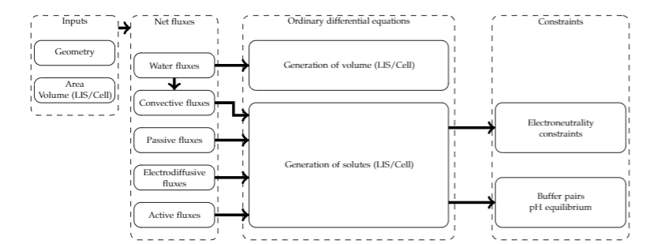
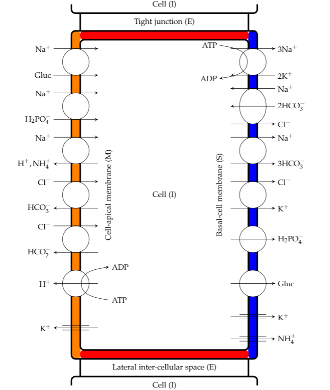

Here we provide the implementation described in: A modular and reusable model of epithelial transport in the proximal convoluted tubule.

This repository contains the following Python scripts:

* The W-PCT-E model simulation can be found in the Python code: ``W_PCT_E_Sim_Fig.py``.

* The W-PCT-E model parameters can be found in ``W-PCT-E-Glob.py``.

* To reproduce figures from the article use the Python code: ``Figures_W_PCT_E.py``.

To ensure your Python environment has the required Python modules used in these scripts, but sure to perform something similar to ``pip install -r requirements.txt`` as appropriate for your platform and Python environment.

The various findings reported in the article can be reproduced using these scripts in the following manner.

1. To reproduce the published observations and predictions of [Weinstein2007]_, reader needs to tune the model parameters accordingly by defining ``if2007 = 1`` in ``W-PCT-E-Glob.py``.

2. To reproduce the result from [Weinstein1992]_, the model parameters and boundary conditions should be tuned by defining  ``Figure_4a = 1``, ``Figure_4b = 1`` and ``Figure_4c = 1``.

3. To reproduce the result from [Latta1984]_, we tune the boundary conditions by defining ``Figure_5 = 1``.

4. To reproduce the results related to structural analysis and to investigate the effect of different transporters in the W-PCT-E, we define ``Figure_6_7_8 = 1``.

5. To demonstrate the comprehensiveness and flexibility of the W-PCT-E model, we explore various physiological phenomena using our model, to reproduce those results define ``Figure_9_10=1``.

In all cases, the total time for simulation is 2000s and the time step sets to 0.1s.
The simulation needs to run long enough to reach the steady-states.

Model overview
==============
In this project, we review the collection of proximal convoluted tubule epithelial transport models from Weinstein et al.;
we derive a consistent, reproducible, and reusable PCT epithelial transport model.  The comprehensive PCT epithelial model
consists of cellular and lateral intercellular compartments located between luminal and peritubular solutions.
The model includes fifteen different solutes in each compartment and two impermeant species within the system.
The following block diagram summarizes what we have done in the primary Python function of the model.
The model begins with the geometrical inputs such as cell volume, lateral intercellular volume, the basement membrane area, and the epithelial thickness.
The second box then indicates the intraepithelial fluxes; there will be five terms to define all the different
fluxes in all different compartments for all the various solutes in the model. These fluxes will be involved in the mass conservation equations.
The third box indicates the differential equations present in the PCT-epithelial model, 35 in total.
The differential equations will be updated by the buffer pairs, PH equilibrium, and electroneutrality definitions.

A block diagram of the W-PCT-E model.

Model status
=============
The current W-PCT-E model implementation in Python runs in Python 3.9.0 [MSC v.1927 64 bit (AMD64)] on win32.
The W-PCT-E model has been validated through the following experiments:

* The W-PCT-E model reproducibility was tested through replicating some simulation experiments reported in [Weinstein1992]_ and [Weinstein2007]_.

* The W-PCT-E model flexibility and reusability was tested by reproducing a simple model of Na+ transport in the mammalian urinary bladder to study the salt sensitivity , see 'General method for the derivation and numerical solution of epithelial transport models [Latta1984]_.

* Structural analysis of the W-PCT-E model validated the application of the model to the wide range of physiological perturbations.

Modular description
===================
The current Python code divides the mathematical W-PCT-E model into distinct components, which are able to be re-used.
The main Python components are:

Components define convective solute fluxes:
-------------------------------------------
To define the convective solute fluxes (Eq:37), the logarithmic mean membrane solute concentration were used (Eq:38). See Python modules: ``def csf()`` and ``def lmmsc()``.

Components define passive solute fluxes:
----------------------------------------
Passive solute fluxes across all membranes are assumed to occur by electrodiffusion and defined through Goldman equations, see Eqs:(39-41), see Python module: ``def goldman()``.

Components define coupled solute transporters:
----------------------------------------------
Coupled solute transporters in the W-PCT-E model include three different categories of transporters: simple cotransporters, simple exchangers, and complex exchangers.

Proximal tubule cells showing coupled transport pathways and some ion channels
within the luminal and peritubular cell membranes.

K-Cl simple cotransporter with [1:1] stoichiometry, located on Peritubular Membrane which
includes both Cell-Lateral Membrane (ie)/Cell-Basal (is) Membrane, see Eq:(42) and Python module: ``def k-cl()``.

Na-Glucose simple cotransporter with [1:1] stoichiometry, located on Apical  Membrane, see Eq:(43) and Python module: ``def sglt_mi()``.

Na-H2PO4 simple cotransporter with [1:1] stoichiometry, located on  Apical  Membrane, see Eq:(44) and Python module: ``def nah2po4_mi()``.

Na/H simple exchanger with [1:-1] stoichiometry, located on Apical Membrane, see Eq:(45) and Python module: ``def nah()``.

Na/NH4 simple exchanger with [1:-1] stoichiometry, located on Apical Membrane, see Eq:(46) and Python module: ``def nanh4()``.

Cl/HCO3 simple exchanger with [1:-1] stoichiometry, located on Apical  Membrane, see Eq:(47) and Python module: ``def clhco2_mi()``.

Cl/HCO3 simple exchanger with [1:-1] stoichiometry, located on Apical  Membrane, see Eq:(48) and Python module: ``def clhco3_mi()``.

Na-3HCO3 complex transporters at the peritubular membrane with [1 : 3] stoichiometry, see Eq:(50) and Python module: ``def na_hco3()``.

Na/Cl-2HCO3 complex transporters at the peritubular membrane with [1 : -1 : 2] stoichiometry, see Eq:(50) and Python module: ``def na_cl_hco3()``.

NHE3 the luminal membrane antiporter of the proximal tubule introduced in Weinstein 1995, using the kinetic formulation, see Python module: ``def nhe3()``.

In [Weinstein2007]_, two simple exchangers Na/H and Na/NH4 (originally from [Weinstein1992]_) were replaced with Na/H (NHE3) antiporter introduced in [Weinstein1995]_.

Components define active transporters:
---------------------------------------
In the W-PCT-E model, there are two ATPases, the apical membrane H-ATPase and a peritubular Na/K-ATPase.

H-ATPase located on Apical membrane where they push hydrogen ions  from areas of low concentration with high concentration, see Eq:(53) and Python module: ``def h_atp_mi()``.

Na/K-ATPase exchanges three cytosolic Na ions for two peritubular cations, K or NH4, in the way that compete for the binding, see Eqs:(54-58) and Python module: ``def nak_atp()``.

Components define buffer pairs:
-------------------------------
The W-PCT-E model defines different types of buffer pairs, for the mass conservation principle for the buffer pairs formalism see Eqs:(20-25) and also see Python module: ``def buff_activation()``.

Components define the W-PCT-E mass conservations:
-------------------------------------------------
The mass conservation equations define the change of the concentration of the species in the intracellular solution as the transport of solute i into and out of the cell through the apical and basolateral membrane, see Eqs:(6-13) and Python module: ``def eQs()``.

Each of these modules is itself a Python model, which enable the researchers to reuse the these components in their studies.

References
===========

.. [Latta1984] General method for the derivation and numerical solution of epithelial transport models, https://doi.org/10.1007/BF01870733
.. [Weinstein1986] An equation for flow in the renal proximal tubule, https://doi.org/10.1007/BF02460061
.. [Weinstein1992] Chloride transport in a mathematical model of the rat proximal tubule, https://doi.org/10.1152/ajprenal.1992.263.5.F784
.. [Weinstein1995] A kinetically defined Na+/H+ antiporter within a mathematical model of the rat proximal tubule, https://doi.org/10.1085/jgp.105.5.617
.. [Weinstein2007] Flow-dependent transport in a mathematical model of rat proximal tubule, https://doi.org/10.1152/ajprenal.00392.2006
.. [Weinstein2011] Potassium deprivation: a systems approach, https://doi.org/10.1152/ajprenal.00430.2011

